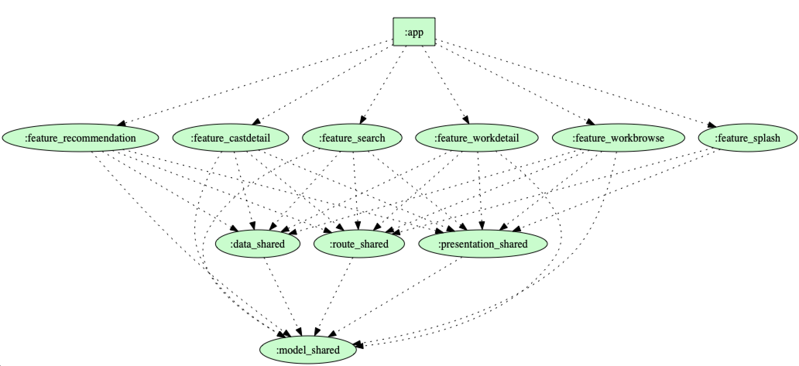

# BESTV
[](https://kotlinlang.org)


Android TV App powered by [TMDb](https://www.themoviedb.org/)

It is a easy way to find the best TV content, the top movies, tv shows and more, all of that in your TV. The goal of the project is to be a guide line about Android TV, showcasing modern Android TV development using Jetpack Compose for TV. The project also uses the popular libraries and tools from the Android ecosystem with a focus on declarative UI and reactive programming.

<br />

https://github.com/user-attachments/assets/1b5f0e90-494d-43ae-bc94-110370db3cf7

## Project
- 100% [Kotlin](https://kotlinlang.org/)
- Android TV with Jetpack Compose for TV
- MVI Architecture Pattern
- Clean Architecture
- Android Architecture Components
- Dependency Injection with Dagger
- Reactive Programming with Kotlin Coroutines and Flow

## Tech-stack
This project uses the popular libraries and tools from the Android ecosystem.
- Tech-stack
    - [Kotlin](https://kotlinlang.org/)
    - Android TV
        - [Jetpack Compose for TV](https://developer.android.com/jetpack/compose/tv) declarative UI framework
        - [Recommend TV content](https://developer.android.com/training/tv/discovery/recommendations)
    - Android Architecture Components
        - [ROOM](https://developer.android.com/topic/libraries/architecture/room) local data storage
        - [Lifecycle-aware components](https://developer.android.com/topic/libraries/architecture/lifecycle)
        - [ViewModel](https://developer.android.com/topic/libraries/architecture/viewmodel) UI state management
    - [Retrofit](https://square.github.io/retrofit/) networking
    - [Kotlin Coroutines](https://kotlinlang.org/docs/coroutines-overview.html) asynchronous programming
    - [Kotlin Flow](https://kotlinlang.org/docs/flow.html) reactive streams
    - [Coil](https://coil-kt.github.io/coil/) image loading library for Compose
    - [Lottie](http://airbnb.io/lottie) animation library
- Architecture
    - MVI (Model-View-Intent)
    - [Clean Architecture](https://proandroiddev.com/kotlin-clean-architecture-1ad42fcd97fa)
- Tests
    - [Unit Tests](https://en.wikipedia.org/wiki/Unit_testing)
    - [Mockito](https://github.com/mockito/mockito) 
    - [Mockito-Kotlin](https://github.com/nhaarman/mockito-kotlin)
- Gradle
    - [Ktlint plugin](https://github.com/JLLeitschuh/ktlint-gradle)

## API Documentation
BESTV uses [the version 3 of The Movie Database (TMDb) API](https://developers.themoviedb.org/3/getting-started/introduction). You can find all the documentation about the requests and the responses responses there.

## API Keys
BESTV uses [The Movie DB](https://www.themoviedb.org/) API in order to fetch all the data, but is not endorsed or certified by TMDb.
To be able to run this application you have to create an API KEY from The Movie DB and place it in your gradle file.
<br>
```
buildConfigField "String", "TMDB_API_KEY", "YOUR API KEY HERE"
```

## Features
<ul>
<li>Show the top movies and tv shows</li>
<li>Show the top movies and tv shows by genre</li>
<li>Details about a work including the casts, the videos, the similar and recommended works</li>
<li>Details about a cast including the credits</li>
<li>Search the movies and the tv shows by title</li>
</ul>

## Recent Updates
- ✅ Migrated from Leanback library to Jetpack Compose for TV
- ✅ Adopted MVI (Model-View-Intent) architecture pattern
- ✅ Replaced RxJava/RxAndroid with Kotlin Coroutines and Flow
- ✅ Updated UI layer to use declarative Compose components

## Modules
The app is modularized. We can see the dependency graph with all the modules.
<p align="center">
  
</p>

## References
- [Jetpack Compose for TV](https://developer.android.com/jetpack/compose/tv)
- [Compose for TV samples](https://github.com/android/tv-samples)
- [Google Codelab TV Recommendations](https://github.com/googlecodelabs/tv-recommendations)
- [MVI Architecture with Kotlin](https://proandroiddev.com/mvi-architecture-with-kotlin-flows-and-channels-d36820b2028d)
- [Dagger2: @Component.Factory and @SubComponent.Factory](https://android.jlelse.eu/dagger2-component-factory-and-subcomponent-factory-b181ec96b213)
- [Why you need Use Cases/Interactors](https://proandroiddev.com/why-you-need-use-cases-interactors-142e8a6fe576)
- [Modularization - Lessons learned](https://jeroenmols.com/blog/2019/06/12/modularizationtips/)
- [Gradle dependency management with Kotlin (buildSrc)](https://proandroiddev.com/gradle-dependency-management-with-kotlin-94eed4df9a28)
- [Using Dagger in Android apps](https://developer.android.com/training/dependency-injection/dagger-android)
- [Kotlin Coroutines and Flow](https://kotlinlang.org/docs/coroutines-guide.html)

## Licence
```
Copyright (c) 2018 Marcus Pimenta

Licensed under the Apache License, Version 2.0 (the "License");
you may not use this file except in compliance with the License.
You may obtain a copy of the License at

http://www.apache.org/licenses/LICENSE-2.0

Unless required by applicable law or agreed to in writing, software
distributed under the License is distributed on an "AS IS" BASIS,
WITHOUT WARRANTIES OR CONDITIONS OF ANY KIND, either express or implied.
See the License for the specific language governing permissions and
limitations under the License.
```