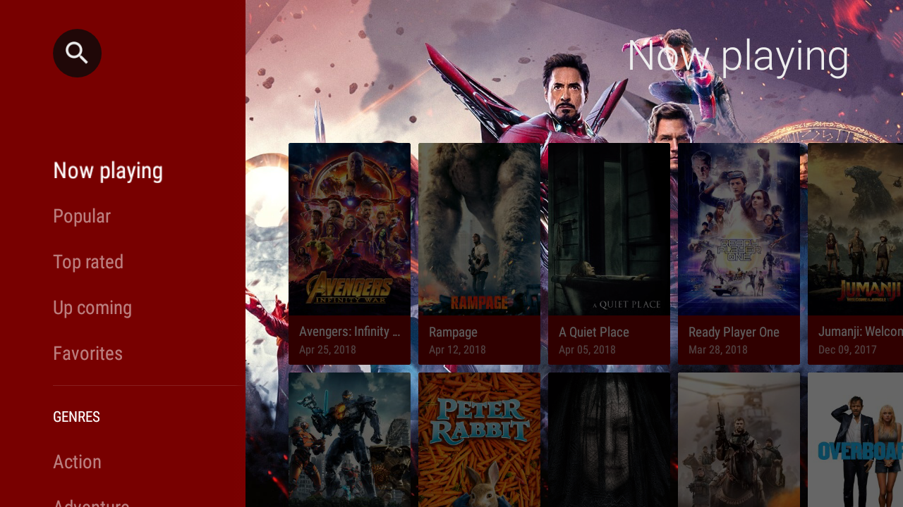
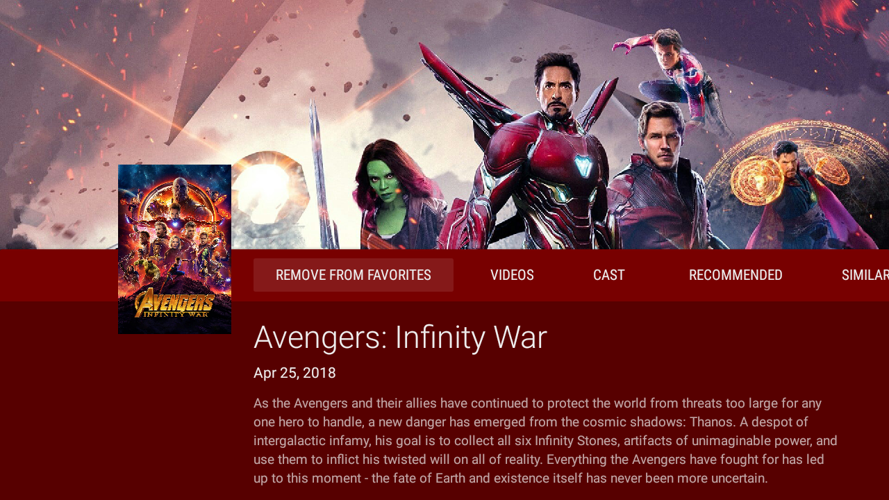
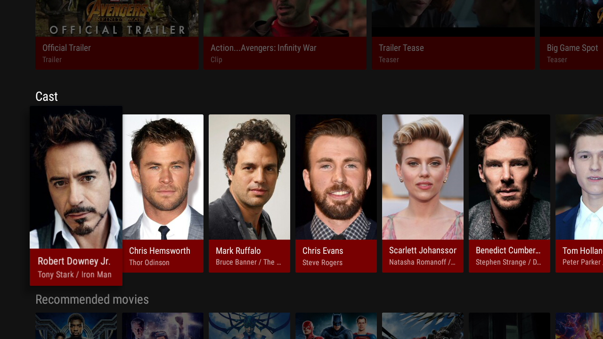
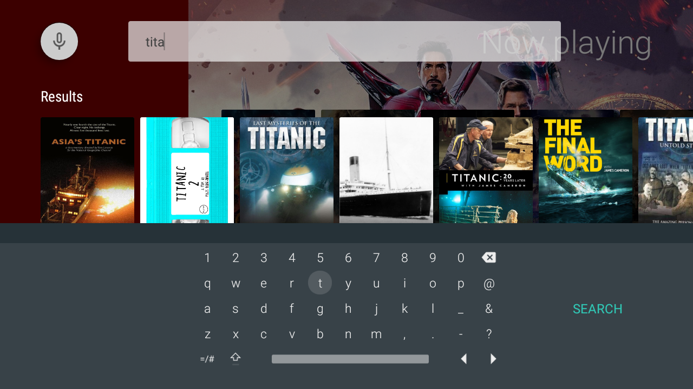

# BesTV
Android TV App powered by TMDb. 
It is a easy way to find the best TV content, the top movies, series... all of that in your TV.

## About
Sample about Android TV, that shows how to use the Leandback library from Google. The main widgets like BrowseFragment, SearchFragment, DetailsFragment, VerticalFragment are used.

## Implementations
<ul>
<li>API The Movie Database (TMDb)</li>
<li>Dagger 2
<li>Retrofit 2
<li>RxJava 2  
<li>Glide
</ul>

## Screenshots
<p align="center">  </p>
<p align="center">  </p>
<p align="center">  </p>
<p align="center">  </p>

## Licence
```
Copyright (c) 2018 Marcus Pimenta

Licensed under the Apache License, Version 2.0 (the "License");
you may not use this file except in compliance with the License.
You may obtain a copy of the License at

http://www.apache.org/licenses/LICENSE-2.0

Unless required by applicable law or agreed to in writing, software
distributed under the License is distributed on an "AS IS" BASIS,
WITHOUT WARRANTIES OR CONDITIONS OF ANY KIND, either express or implied.
See the License for the specific language governing permissions and
limitations under the License.
```
