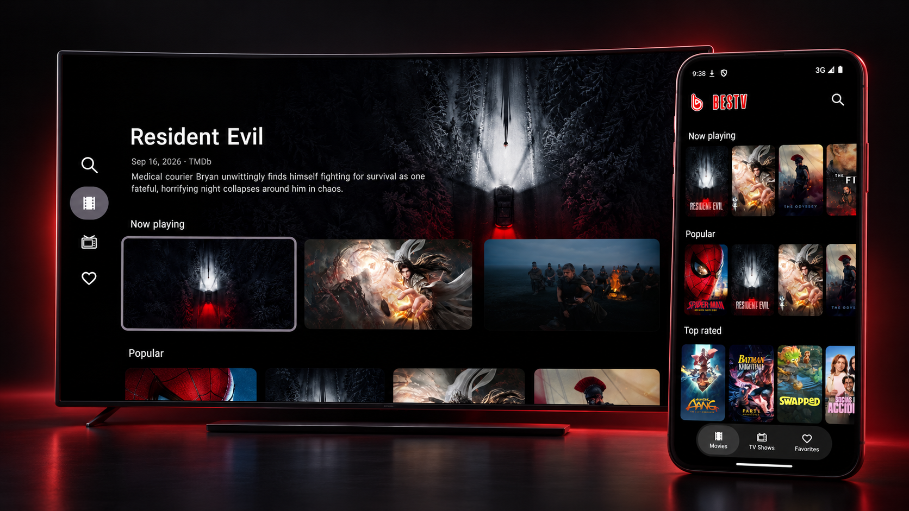
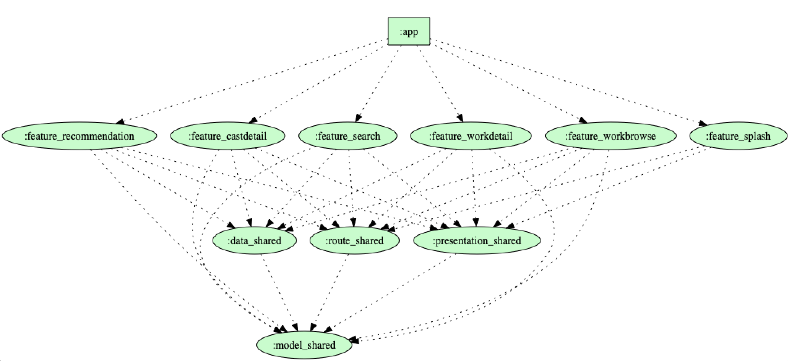

<h1 align="center">
  
  
</h1>

BESTV is a Kotlin app for discovering movies and TV shows on **Android TV and mobile devices**, powered by [TMDb](https://www.themoviedb.org/).

The app has dedicated interfaces for both form factors: remote-friendly navigation on TV and touch-first layouts on mobile. The platforms share the same data, domain, and navigation layers.

## TV and mobile showcase

The composite bellow pairs the TV and mobile experiences. Each platform adapts browsing and discovery to its screen and input method.

<p align="center">
  
</p>

## Features

- Browse popular, top-rated, upcoming, and genre-based movies and TV shows.
- Search movies and TV shows by title.
- View work details, cast, videos, streaming providers, similar works, and recommendations.
- View cast biographies and credits.
- Save favorites.
- Use a TV interface designed for remote control or mobile layouts designed for touch.

## Technology

- Kotlin
- Jetpack Compose for TV and mobile
- Android Architecture Components, including ViewModel and Room
- Kotlin Coroutines and Flow
- Retrofit for networking
- Coil for image loading
- Koin for dependency injection
- Lottie for animations

## Architecture

BESTV uses modular Clean Architecture with MVI presentation state and events.

- [Clean Architecture](CLEAN_ARCHITECTURE.md)
- [MVI Architecture](MVI_ARCHITECTURE.md)
- [Koin dependency injection](KOIN_DI.md)

## Modules

The project is split into modules. The diagram shows their dependencies.

<p align="center">
  
</p>

## TMDb API

BESTV uses [version 3 of the TMDb API](https://developers.themoviedb.org/3/getting-started/introduction). It is not endorsed or certified by TMDb.

To run the app, create a TMDb API key and add it to the Gradle configuration:

```groovy
buildConfigField "String", "TMDB_API_KEY", "YOUR API KEY HERE"
```

## References

- [Jetpack Compose for TV](https://developer.android.com/jetpack/compose/tv)
- [Android TV recommendations](https://developer.android.com/training/tv/discovery/recommendations)
- [Kotlin Coroutines guide](https://kotlinlang.org/docs/coroutines-guide.html)
- [Koin documentation](https://insert-koin.io/docs/quickstart/android/)

## License

Copyright (c) 2018 Marcus Pimenta

Licensed under the Apache License, Version 2.0 (the "License");
you may not use this file except in compliance with the License.
You may obtain a copy of the License at

http://www.apache.org/licenses/LICENSE-2.0

Unless required by applicable law or agreed to in writing, software
distributed under the License is distributed on an "AS IS" BASIS,
WITHOUT WARRANTIES OR CONDITIONS OF ANY KIND, either express or implied.
See the License for the specific language governing permissions and
limitations under the License.
